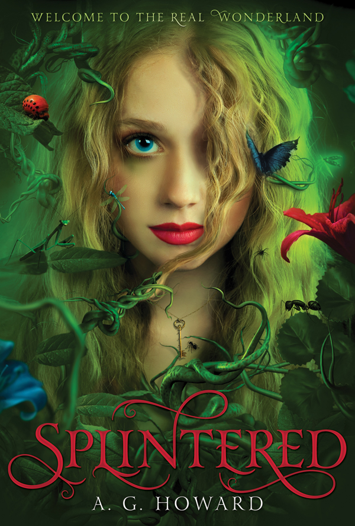
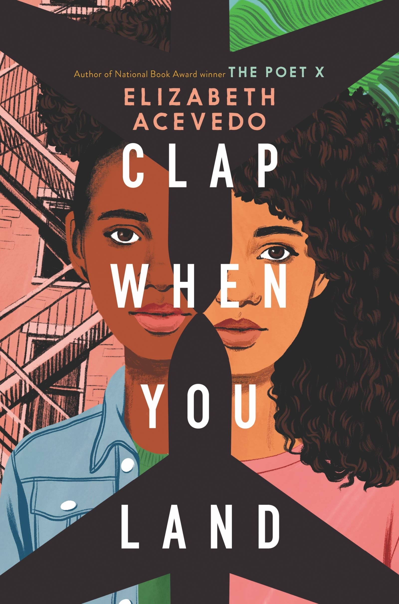

Very excited about this weeks blog post all about book covers!! If you know me you know how much I adore book covers and design. There is so many different elements that go into making a good cover, the typography, the image and formation of it all. For book cover designers it is no longer as simple as adding some words and a haphazard image on the cover! Book covers changed with the increase in online booksellers such as Amazon as it became vital that the customer could see the cover in small on a screen rather than find it while browsing in a bookshop. 

There have been many discussions over the years about what makes a good cover and it is personal preference what you think makes a cover eye-catching. However there are somethings that most people agree make a bad cover! A big one being images of people on covers, not illustrations but photographs. This is a big one as it was so popular a few years ago - think YA books from the early 2010s… 

But this is a trend that people have actively moved away from, if covers now have people on they are more likely to be illustrated. These are some of my current favourites.

I think having people on the cover can be polarising as if a customer doesn’t feel as though that person is a representation of them then they can choose not to pick the book up. As readers we are very lucky that so much work now goes into making a cover aesthetically pleasing, so the covers that used to sell well don’t look as good in comparison.

Do you ever buy books based on the cover? \*raises hand\* Yes all the time! Sometimes it is worth it sometimes it definitely isn’t! Something that I think is very clear by publishers is when they give an average book a stunning cover because you are more likely to pick it up even if it is only gets 3 star ratings!

We’ve talked about what makes a bad book cover - but what about a good one? For me they have a really interesting and visible typography with bright colours. I prefer it when the cover is illustrated rather than an image. Someone who is an amazing talent in this world is Coralie Bickford-Smith. Coralie has designed all the Penguin Clouthbound Classics with her beautiful repeated patterns and the author and illustrator of The Fox and the Star.  

You can’t include a blog post on book covers without showing your favourites so here are my top 5 below! (Some of these I’ve read and some I haven’t) 

IMAGES

What about you - what do you think makes a good cover? Which ones are your favourite?