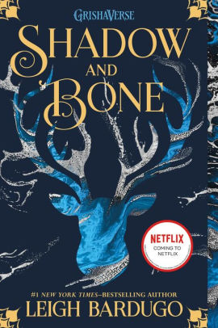
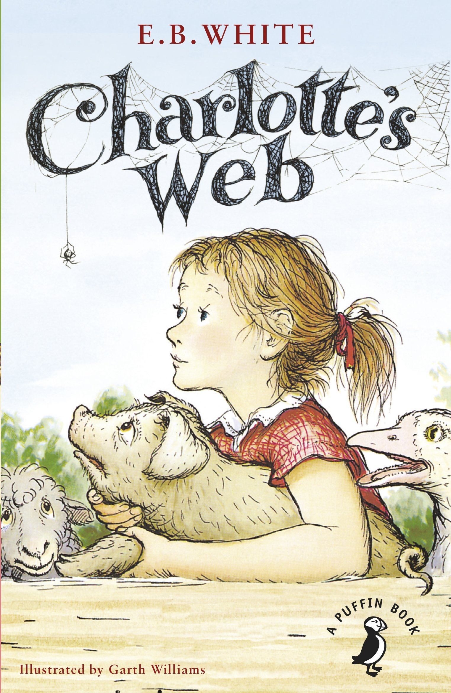
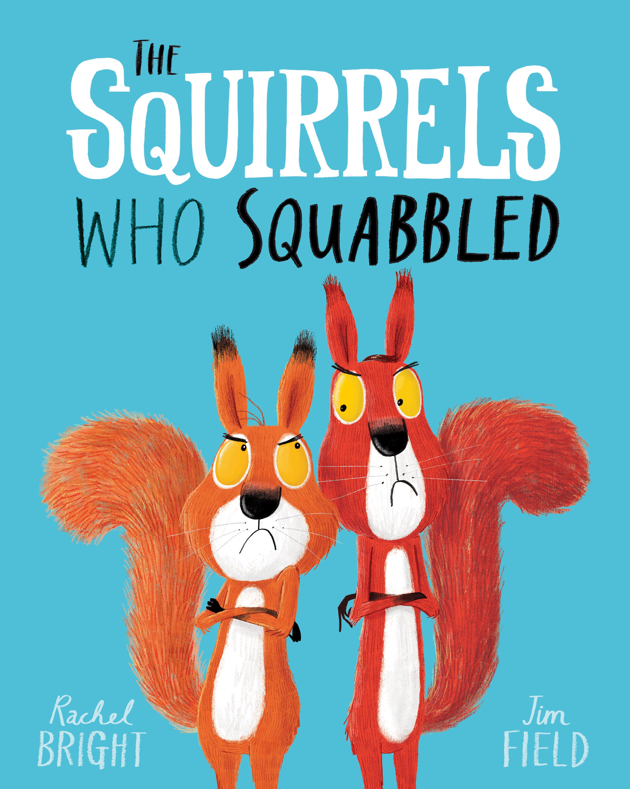

My last blog post was all about book covers, the perfect follow onto that was to discuss typography. This is such an integral part of book covers and book design. By using the correct font it can help to portray the right themes and genre of the book. 

 Fantasy books for example tend to use serif fonts, as seen below:

The examples of The Hobbit and Shadow and Bone show that serif fonts on the cover of fantasy books have been used for many years within the publishing industry. 

 Some books are given their own font as seen on the cover of the Harry Potter books below. This typically comes is more common as books become part of a series or have an on screen adaptation. The lightning shape that is taken from Harry’s scar is iconic and recognisable to many. There have been many discussions over the copyright of the font however courts have declared that you can’t copyright a typeface. 

 Children’s books also have unique typography, it is interesting to see how it is used to attract the attention of small children. With children’s books they tend to use the characters and bright colours on the cover - however on some the title is just as important. Take Charlotte’s Web for example (as seen below) the cover features all the characters but perfectly incorporates the typeface into the cover by creating it out of Charlotte’s Web.

The Children’s picture book ‘The Squirrels Who Squabbled’ uses four different fonts and the contrast of black and white. I think that this is a really effective way of using engaging fonts to capture a child’s attention.

\
However, it isn’t just about the typeface used on the cover of books but also inside. The typeface that is used for the text isn’t usually as fun as the cover as publishers have to ensure that the font that they select is accessible too many and easy to read. It can be easy to spot a Penguin Random House book based on the font they use which is typically Gill Sans, this was the font that was used on the iconic orange covers. This font is very easy to read and doesn’t use serifs. The Gill Sans font was also used on the London Underground, highlighting its accessibility to many.  

Do you like it when book covers use unique and eye-catching fonts or do you prefer simple and say to read?