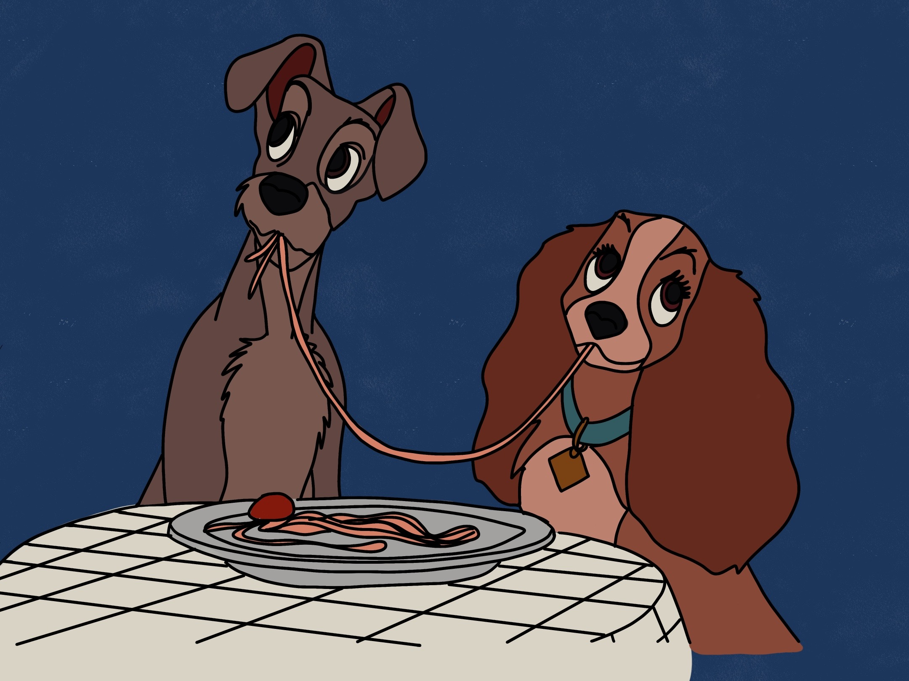

Everybody loves a Disney movie and when presented with the options for my cookbook theme it had to be Disney!! Lady and the Tramp is such an iconic movie especially for this scene where Lady and Tramp eat meatballs together. I really hope you enjoy making this recipe as much as I did.

## Ingredients

### For the Tomato Sauce

* Spaghetti
* 1 400g tin of chopped tomatoes
* 1 clove of garlic/crushed or finely chopped
* 1 onion, finely chopped
* 500ml of vegetable stock 
* 1 tsp of mixed herbs (dried) 
* Salt and pepper to taste 
* 1 tsps of olive oil

### For the Meatballs

* 400g of beef mice (or Turkey)
* 1 clove of garlic/crushed or finely chopped
* 1/2 a tsp of mixed herbs (dried)
* 1 tbsp of olive oil

## Method

1. Turn the hob onto a medium heat, place the large saucepan on the hob and add the olive oil. Once the oil is hot, add the chopped onion and cook gently until soft (4-5 minutes). After this add the garlic for 2 minutes.
2. Add the chopped tomatoes, stock and dried herbs. Bring the sauce to a simmer and then reduce the heat - but let it continue to simmer while you prepare the meatballs
3. Now you can make the meatballs. In a bowl add the mice, garlic and herbs and mix together with wet hands. Now roll the mixture into approx 20 balls.
4. Add the olive oil to a frying pan over a medium heat - once the oil is hot fry the meatballs in small batches, turn them regularly to ensure that all sides are browned and not burnt. Once they are cooked transfer the to the saucepan with the sauce you made earlier still simmering.
5. Continue to cook the sauce for a further 10 minutes - this can be done while you cook the pasta to the instructions on the packet.
6. Mix the cooked pasta into the sauce and serve hot. Enjoy!!

Adapted from: BBC Spaghetti and Meatballs