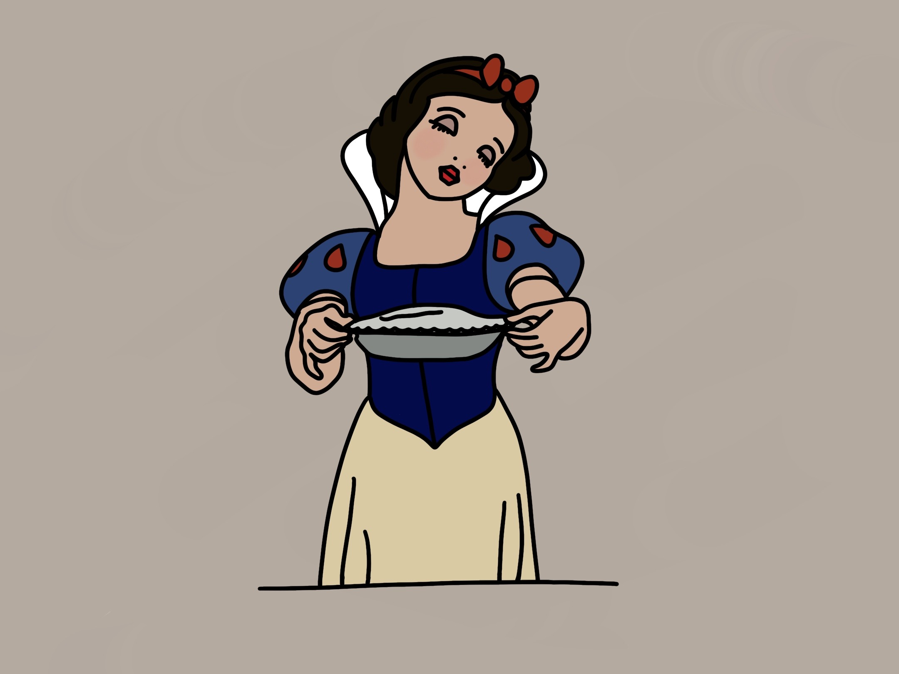

Snow White is a classic Disney movie and so had to be included - although the scene where she eats an apple is the most popular just before this happens she cooks a pie for Grumpy. I thought it was the perfect idea to incoporate the two and make it an apple pie!

## Ingredients

### For the Apple Filling

* 1 kg of Bramley Apples
* 140g of caster sugar 
* 1/2 tsp of cinnamon
* 3 tbs of plain flour 

### For the Pastry 

* 225g of butter - softened to room temperature 
* 50g of caster sugar 
* 2 eggs 
* 350g of plain flour 

## Method 

1. Start by preparing the apples, peel and core them and then slice into 5 mm slices. Lay evenly on kitchen bowl and set aside.
2. To make the pastry, beat the sugar and butter in large bowl until mixed. Add an egg and 1 extra yolk (keep the white to glaze the pastry later). Beat for about a minute until the mixture looks like scrambled egg. Add the flour to the mixture a third at a time. It will begin to form a dough which you can combine further with your hands. Work it into a ball, wrap in cling film and chill for 45 mins. 
3. Mix the 140g of caster sugar, cinnamon and flour into a large bowl. 
4. Once the pasty has chilled preheat the cover to 190°C or 170°C fan. Beat the egg white with a fork. Now take the pastry, leave a third in the cling film which will be the lid later. Roll it out and line your pie tin (20-22cm and 4cm deep). There should be a slight overhang. Take the left over third and roll it into a 28 cm circle. 
5. Pat the apples with the kitchen roll to remove as much moisture as possible and add to the cinnamon sugar mix, stir them in with your hands and then place into the pastry tin. 
6. Brush a small amount of water around the pastry rim to help the lid stick on, place over the apples and press the edges together. Use a sharp knife to trim the edges and make 5 slashes on the top to help release the steam. Brush the top with the eggs white and sprinkle with caster sugar. 
7. Bake for 40-45 min until the pastry is golden. Remove and let it sit for 5-10 mins. Sprinkle more caster sugar and serve warm.

Adapted from: BBC Goodfood