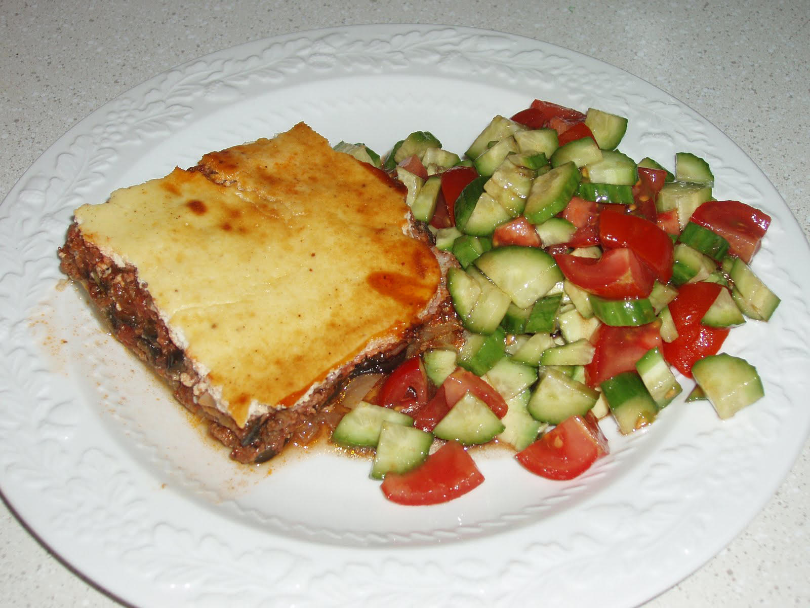

Unfortunatly these Alice in Wonderland inspired biscuits won't make you grow but they are good fun to make (and eat)!

## Ingredients

### For the Biscuits

* 300g of plain flour
* 1/4 tsp of slat
* 150g of caster sugar 
* 150g of cold unsalted butter (diced) 
* 1 large egg 
* 1 tsp of vanilla extract 

### For the icing 

* 400g of icing sugar 
* 75ml of water 
* Gel food colouring (colours of your choice)
* Icing pen

## Method

1. Preheat the oven to 180°C or 160°C Fan. Line 2 baking trays with baking parchment.
2. Combine the flour, salt and caster sugar. Add the butter and rub together with your hands until the mixture looks like bread crumbs
3. Beat the egg and vanilla together with a fork and then mix into the other ingredients. Knead until combines. Chill the dough in the fridge until it is firm and then roll out into a dusted surface. It should be about 4-5mm thick. Cut out 8cm circles (or whichever shapes you prefer) and move onto the baking trays. To help them keep their shape chill again in the fridge for 15 mins. 
4. Bake for 15-17 minutes until golden an then remove from the oven and cool on a wire rack
5. While they cool you can make the icing, add about 65 ml of water to the icing sugar and beat until it is fairly thick and smooth. Be careful about the consistency because it you have to be able to pipe it. Take a quarter of the icing and transfer it into a piping back with a very small nozzle (No2). Set aside.
6. Add the remaining water to the icing in drops or until it is pourable, this is the flooding icing. Once you have the right constancy transfer into as many bowls as needed for your coulis choices. Add the food colouring, and place into piping bags,
7. Use the thicker icing to draw an outline of your shape onto the biscuit. Pipe enough of the coloured icing to fill the shape drawn. Use a toothpick to gently move the icing to the outline you have drawn. The biscuit can be shaken gently to get the icing smooth. 
8. Once this has set, allow about 30 mins, use the icing pen to write the words ‘Eat me’ or ‘Take on’ onto the centre of the biscuit. 

Adapted from: BBC Goodfood