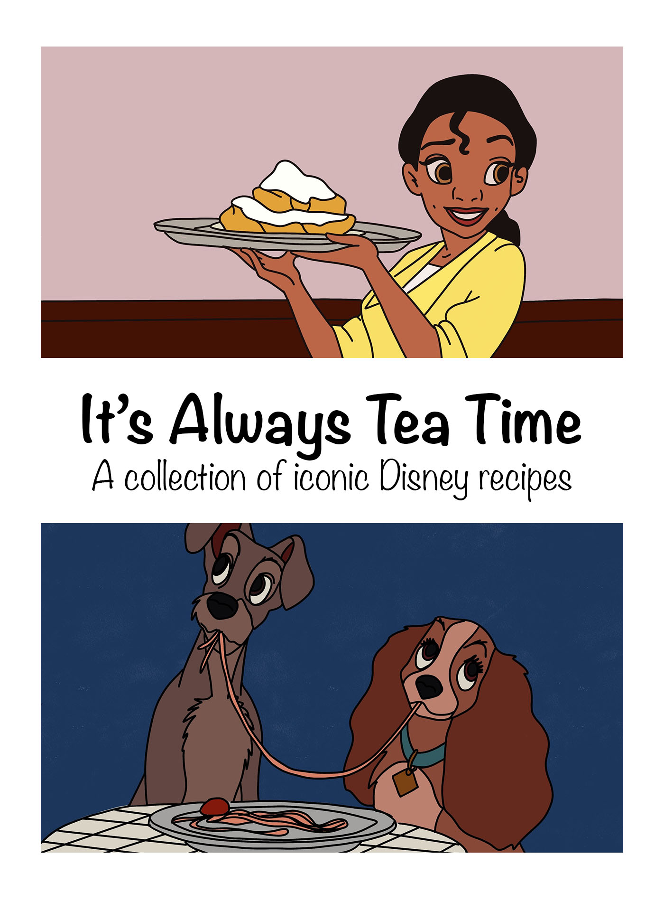

Disney films are loved by many people across generations. For many years people have dedicated lots of time to replicating the food mentioned in the films and from the Disneyland parks. During the pandemic, social media such as TikTok has further increased this craze for reproducing the food, as people found themselves stuck at home and either missing going to the parks or spent more time watching the films. I have created a collection of six recipes from my favourite Disney films. There are three savoury and three sweet recipes so you could cook a whole meal following these recipes. How about Kronk’s Spinach Puffs for a starter, Remy’s Ratatouille for main followed by Tiana’s Beignets for dessert! YUM!!

To see all the recipes click [HERE](https://adiscoveryof.netlify.app/allrecipes)